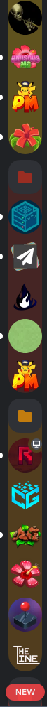

# Blue's BetterDiscord 🅱️lugins

> If you are looking for high quality JavaScript code, you will not find that here.
>
> Open to PRs!

## `better-folders` 

BetterFolders applies a folder's icon colour to it's background when expanded. In my opinion, this makes it far easier
to recognize the boundaries between folders, and see what folder you are in when it takes up the whole height.

