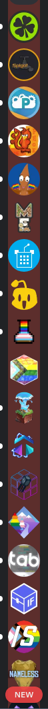

# Blue's BetterDiscord 🅱️lugins

This repository contains a collection of BetterDiscord plugins that make my life easier in some way.
(well.. going to. Just one plugin for now.)

> 🚨 These plugins were not designed with JavaScript best practices in mind - I just wanted to make something that works.
>
> Open to PRs and suggestions!

## Installation

1. Install [BetterDiscord](https://betterdiscord.app/)
2. Download the plugins you want, and move them to your BetterDiscord plugins folder
3. Enable the plugin
4. ???
5. Profit XDDDDDDDDDD

## `better-folders` 

[direct download link](https://raw.githubusercontent.com/kadenscott/bbb/master/better-folders.plugin.js?)

BetterFolders applies a folder's icon colour to its background when expanded. In my opinion, this makes it far easier
to recognize the boundaries between folders, and see what folder you are in when it takes up the whole height.

**Caveats**:

- Background colour will not automatically update when adjusting folder colours.
  Closing the folder and re-opening it will fix this issue.
- Occasionally, folder background colours won't be applied during BetterDiscord's startup sequence. Until I can properly troubleshoot this issue, an easy fix is reloading the plugin if you are missing background colours.

 